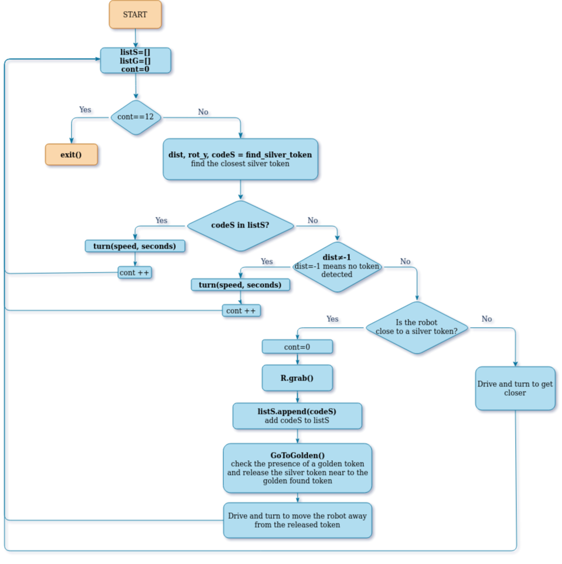

# *PYTHON ROBOT SIMULATOR*

> Professor Carmine Recchiuto, <p>Student: Anna Possamai


## *RUNNING THE CODE*
The simulator requires a Python 2.7 installation, the pygame library, PyPyBox2D, and PyYAML.

You can run this project by write in the terminal this command:
```
$ python run.py Assignment.py
```

## *ASSIGNMENT GOAL*

The goal of this assigment is to search and find a silver token and bring it near to a golden token so that in the final there will be golden and silver tokens distribuited in pairs.

## *ROBOT*


### *Robot API*


The API for controlling a simulated robot is designed to be as similar as possible to the [SR API][sr-api].

### *Motors* ###

The simulated robot has two motors configured for skid steering, connected to a two-output [Motor Board](https://studentrobotics.org/docs/kit/motor_board). The left motor is connected to output `0` and the right motor to output `1`.

The Motor Board API is identical to [that of the SR API](https://studentrobotics.org/docs/programming/sr/motors/), except that motor boards cannot be addressed by serial number. So, to turn on the spot at one quarter of full power, one might write the following:

```python
R.motors[0].m0.power = 25
R.motors[0].m1.power = -25
```

### *The Grabber* ###

The robot is equipped with a grabber, capable of picking up a token which is in front of the robot and within 0.4 metres of the robot's centre. To pick up a token, call the `R.grab` method:

```python
success = R.grab()
```

The `R.grab` function returns `True` if a token was successfully picked up, or `False` otherwise. If the robot is already holding a token, it will throw an `AlreadyHoldingSomethingException`.


To drop the token, call the `R.release` method.

Cable-tie flails are not implemented.

### *Vision* ###

To help the robot find tokens and navigate, each token has markers stuck to it, as does each wall. The `R.see` method returns a list of all the markers the robot can see, as `Marker` objects. The robot can only see markers which it is facing towards.

Each `Marker` object has the following attributes:

* `info`: a `MarkerInfo` object describing the marker itself. Has the following attributes:
  * `code`: the numeric code of the marker.
  * `marker_type`: the type of object the marker is attached to (either `MARKER_TOKEN_GOLD`, `MARKER_TOKEN_SILVER` or `MARKER_ARENA`).
  * `offset`: offset of the numeric code of the marker from the lowest numbered marker of its type. For example, token number 3 has the code 43, but offset 3.
  * `size`: the size that the marker would be in the real game, for compatibility with the SR API.
* `centre`: the location of the marker in polar coordinates, as a `PolarCoord` object. Has the following attributes:
  * `length`: the distance from the centre of the robot to the object (in metres).
  * `rot_y`: rotation about the Y axis in degrees.
* `dist`: an alias for `centre.length`
* `res`: the value of the `res` parameter of `R.see`, for compatibility with the SR API.
* `rot_y`: an alias for `centre.rot_y`
* `timestamp`: the time at which the marker was seen (when `R.see` was called).

## *CODE* ##

### *FLOWCHART* ###



At the beginning the program looks for the nearest silver token with the function:
```python    
dist, rot_y, codeS = find_silver_token()
```
Once it has checked that the `codeS` of the silver token is not in `listS`, the program approaches the found silver token with the `turn()` and `drive()` functions.

When the robot is close to the silver token, it grabs it (via the `R.grab()` command) and goes to the nearest golden token (via the `GoToGolden()` function).

```python    
  GoToGolden()
```
The `GoToGolden` function works like this:
1. First it searches for the nearest golden;
2. Then, once it has been checked that the codeG is not in the listG, the robot approaches the found golden token in the same way used to approach the silver token;
3. Finally, when the robot is close to the golden token, it releases the silver token with the function `R.Release()`, then registers the golden token in listG, and so it moves away.

These functions are iterated within the `while()` loops in the program until the robot sees all the blocks paired once it has turned at least 360° (this condition occurs when `cont==12`).

Finally, when `cont==12`, the program ends.

## *FUTURE IMPROVEMENTS*
In some positions, when blocks are in the middle of the robot's 'moving area, it could drag these tokens with it, creating **collisions**.

To avoid this, special functions could be created to increasing its "**environmental awareness**".

In addition, when the robot searches for the nearest block, if the block is close but behind the robot itself, the robot cannot see it. If, on the other hand, the robot had **360-degree vision**, then it would be able to see it and catch it, making the program more efficient.

Another possible improvement could be to create a map of the arena. If the robot could record the positions of the various tokens in the arena by creating a map of the arena itself, it would be much faster because it would no longer be necessary to scan the arena within each while cycle. 
This would also allow a better path management, e.g. avoiding obstacles (represented in this case by the tokens themselves).
 
Therefore, in order to achieve these improvements, as well as appropriate functions, it could be necessary to **increase the robot's vision range**.
